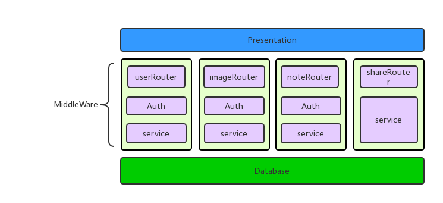

# LiteNote
## 简介
LiteNote是一个轻量级的云笔记，支持笔记的在线创建，编辑，分享。js全栈开发。

在线体验地址：[]()

主要技术：
 - 前端react框架,基于webpack构建
 - 前端主题：[material-ui](https://github.com/mui-org/material-ui)
 - 数据库：mariadb
 - 后端：express

## 部署
实际上做了跨域处理，静态页面和服务器接口服务器可以分离，此处方便考虑：  
1. 首先克隆，进入目录
```
git clone https://github.com/XUranus/liteNote.git
cd liteNote
```

2. 修改环境配置
```
mv env.json.example env.json
vim env.json
```
编辑`env.json`的环境配置文件，格式如下，需要声明服务器端口，域名。和mysql数据库相关配置。
```js
{
    "nodeServer":{
        "port":8080
    },
    "mySQL":{
        "host":"localhost",
        "user":"root",
        "password":"****",
        "database":"note",
        "multipleStatements":false
    }
}
```

3. 修改前端配置：
```
mv src/reactEnv.json.example src/reactEnv.json
vim src/reactEnv.json
```
前端配置如下：
```js
{
    "server":{
        "host": "localhost",
        "port":8080,
        "protocol": "http"
    }
}%      
```
该文件中还声明了前端和后端服务通信的地址（换成公网地址），然后安装依赖，webpack构建前端组件
```
npm install
npm run build
```

4. 手动创建一个数据库，数据库名字必须和之前第2步中申明的数据库同名，然后迁移数据库并启动
```
node migrate.js up
node start.js
```

## 架构
前后端可以独立部署在不同的环境上，前后端之间用json通信

### 前端(表示层)
前端使用mvvm架构的react框架，把组件的状态和数据绑定，axios函数和后台通信，触发对DOM的修改。

### 后端(逻辑层和数据层)


后端使用express框架，配合express的路由(Router)机制和express中间件机制，对各个组件实现了服务划分。所有的请求通过主主路由转发到各个分支的路由上:
```js
apiRouter.use('/user',require('./userRouter')());
apiRouter.use('/note',require('./noteRouter')());
apiRouter.use('/share',require('./shareRouter')());
```

中间件实现了对请求的集中鉴权，例如，note模块中，处理笔记相关的请求，必须判定用户的session是否过期，session中的user_id和是否拥有访问note_id对应的笔记的权限：
```js
noteRouter.use('/',(req,res,next)=>{ //用户验证(必须)
    if(req.session['user_id']==null) 
        res.json({
            success:false,
            msg:'you are not logged'
        }).end();
    else {
        user_id = req.session['user_id'];
        next();
    }
});

noteRouter.use('/',(req,res,next)=>{ //笔记权限验证
    var note_id = req.body.note_id;
    note_access_privilege(note_id,user_id,(access)=>{
        if(note_id==null||access) next();
        else make_unauthorized_res(res);
    });
});
```
这样，该模块所有的鉴权工作就集中在两个函数中完成了。

部分接口如下:

|  接口    |   描述   |
| ------- | ------- |
| /api/user/register | 用于注册，提交注册信息，返回操作结果 |
| /api/user/login | 用于登陆，提交登陆表单，返回状态结果|
| /api/user/getInfo | 获取用户信息 |
| /api/user/modifyInfo | 修改用户信息 |
| /api/user/updatePassword | 更新密码 |
| /api/note/newNote| 创建新笔记，提交笔记名称格式，返回笔记ID |
| /api/note/deleteNote | 删除笔记，提交笔记ID，返回操作结果 |
| /api/note/modifyNoteContent | 修改笔记内容 |
| /api/note/noteList | 获取用户笔记列表 |
| /api/note/getNote | 提交笔记的ID，根据ID获取笔记信息 |
| /api/image/uploadImage | 上传图片，返回图片地址 |
| /api/share/getAuthorInfo | 获取笔记作者的基本信息 |
| /api/share/getNote | 根据笔记的分享token，获取笔记信息 |